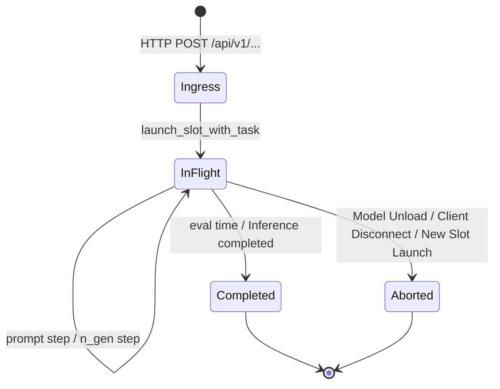

# Lemonade Server Inference Telemetry & TUI: Full Architecture & Reference Guide

A comprehensive technical manual covering operational usage, interface reference, mathematical theory of Large Language Model (LLM) inference metrics, and systems internals for the Lemonade Server inference telemetry architecture and the `lemonade_tui` Terminal User Interface.

---

# Table of Contents

1. [User Guide (Operational Manual)](#1-user-guide-operational-manual)
   - [1.1 Overview & Capabilities](#11-overview--capabilities)
   - [1.2 Prerequisites & Environment Setup](#12-prerequisites--environment-setup)
   - [1.3 Command-Line Interface & Execution Modes](#13-command-line-interface--execution-modes)
   - [1.4 Path Resolution & Multi-Platform Support](#14-path-resolution--multi-platform-support)
   - [1.5 Interactive TUI Walkthrough & Views](#15-interactive-tui-walkthrough--views)
   - [1.6 Dynamic Streaming vs. Static Snapshot Modes](#16-dynamic-streaming-vs-static-snapshot-modes)
   - [1.7 Keyboard Navigation & Shortcut Reference](#17-keyboard-navigation--shortcut-reference)
   - [1.8 Exporting Automated Telemetry Reports](#18-exporting-automated-telemetry-reports)
2. [Reference Guide (Syntax, API & Specifications)](#2-reference-guide-syntax-api--specifications)
   - [2.1 CLI Argument Specification](#21-cli-argument-specification)
   - [2.2 Lemonade Server Log Grammar & Regex Specification](#22-lemonade-server-log-grammar--regex-specification)
   - [2.3 Data Models & Schema Reference](#23-data-models--schema-reference)
   - [2.4 Task Lifecycle State Machine](#24-task-lifecycle-state-machine)
3. [Theory of Metrics (LLM Inference Systems Architecture)](#3-theory-of-metrics-llm-inference-systems-architecture)
   - [3.1 Two-Phase Execution: Prefill (Compute-Bound) vs. Decode (Memory-Bound)](#31-two-phase-execution-prefill-compute-bound-vs-decode-memory-bound)
   - [3.2 Time To First Token (TTFT) & Attention Scaling Slowdown](#32-time-to-first-token-ttft--attention-scaling-slowdown)
   - [3.3 Autoregressive Decode Speed, Memory Bandwidth & Rolling Throughput (`tg_3s`)](#33-autoregressive-decode-speed-memory-bandwidth--rolling-throughput-tg_3s)
   - [3.4 Multi-Token Prediction (MTP) & Speculative Decoding Dynamics](#34-multi-token-prediction-mtp--speculative-decoding-dynamics)
   - [3.5 Execution Graph Caching (CUDA / Metal / ROCm Graphs)](#35-execution-graph-caching-cuda--metal--rocm-graphs)
   - [3.6 KV Cache Retention, Slot Allocation & Context Limits](#36-kv-cache-retention-slot-allocation--context-limits)
   - [3.7 Queue Latency & Scheduling Delays](#37-queue-latency--scheduling-delays)
4. [Internals & Performance Engineering](#4-internals--performance-engineering)
   - [4.1 Streaming Stateful Log Parser Architecture](#41-streaming-stateful-log-parser-architecture)
   - [4.2 Solving Event Loops & Virtualized Layout Thrashing in Textual](#42-solving-event-loops--virtualized-layout-thrashing-in-textual)
   - [4.3 High-Performance Debounced Table Navigation](#43-high-performance-debounced-table-navigation)
   - [4.4 In-Place Data Mutation vs. Full Re-Rendering](#44-in-place-data-mutation-vs-full-re-rendering)
   - [4.5 Single-Pass Pipeline & Startup Acceleration](#45-single-pass-pipeline--startup-acceleration)
   - [4.6 Lightweight Terminal Dashboard via `rich.live.Live`](#46-lightweight-terminal-dashboard-via-richlivelive)
   - [4.7 UI Layout Stabilization & Fixed-Width Task ID Formatting](#47-ui-layout-stabilization--fixed-width-task-id-formatting)

---

# 1. User Guide (Operational Manual)

## 1.1 Overview & Capabilities

Modern high-performance LLM engines such as Lemonade Server (often built upon optimized runtimes like `llama.cpp` or custom backends) produce detailed diagnostic streams that reveal what happens inside the GPU/NPU during inference. 

`lemonade_tui.py` is a specialized telemetry analysis suite that parses, correlates, calculates, and visualizes this operational telemetry. It provides:
* **Interactive Terminal User Interface (TUI):** Built with Python Textual, featuring real-time telemetry streaming, keyboard navigation, tabbed diagnostic panes, and visual progress indicators.
* **Lightweight Terminal Dashboard (`--static`):** Built with Rich, rendering immediate formatted summaries or live auto-refreshing monitors directly into the standard console without entering a fullscreen alternate screen buffer.
* **Automated Markdown Report Generation (`--export`):** Generates structured Markdown reports suitable for CI/CD benchmarking, model evaluation, and performance tracking.

```
                  ┌───────────────────────────────────────────────┐
                  │          Lemonade Server Log Stream           │
                  │   (HTTP, launch_slot, prompt, tg, eval, MTP)  │
                  └───────────────────────┬───────────────────────┘
                                          │
                                          ▼
                  ┌───────────────────────────────────────────────┐
                  │    LemonadeLogParser (Streaming Ingestion)    │
                  │      State Machine, Lifecycle Correlation     │
                  └───────┬───────────────────────────────┬───────┘
                          │                               │
            ┌─────────────┴─────────────┐   ┌─────────────┴─────────────┐
            ▼                           ▼   ▼                           ▼
┌───────────────────────┐   ┌───────────────────────┐   ┌───────────────────────┐
│   Textual TUI App     │   │   Terminal Dashboard  │   │    Markdown Export    │
│  - Fullscreen Nav     │   │  - Single Shot Output │   │  - Static Benchmark   │
│  - 6 Diagnostic Tabs  │   │  - Live Watch Mode    │   │    Reports for CI/CD  │
│  - Dynamic / Static   │   │  - Zero TUI Overhead  │   │    Documentation      │
└───────────────────────┘   └───────────────────────┘   └───────────────────────┘
```

---

## 1.2 Prerequisites & Environment Setup

The suite requires **Python 3.10+** (recommended **Python 3.12**) and uses standard modern packaging tools (`uv` or `pip`).

### Dependencies
* `rich >= 13.0.0` (Console rendering, formatting, tables, panels)
* `textual >= 0.80.0` (Terminal User Interface framework)

### Recommended Installation with `uv`
```powershell
# Run directly with uv (virtualenv is automatically provisioned)
uv run python .\lemonade_tui.py
```

### Standard `pip` Installation
```bash
python -m venv .venv
# Windows PowerShell
.venv\Scripts\Activate.ps1
# Linux / macOS
source .venv/bin/activate

pip install rich textual
python lemonade_tui.py
```

---

## 1.3 Command-Line Interface & Execution Modes

`lemonade_tui.py` provides four distinct operational modes tailored to different operational needs:

```powershell
# Mode 1: Interactive Fullscreen TUI (Dynamic Live Streaming by default)
uv run python .\lemonade_tui.py "$env:TEMP\lemonade-server.log"

# Mode 2: Interactive Fullscreen TUI in Static Snapshot Mode (Zero background polling)
uv run python .\lemonade_tui.py --snapshot "$env:TEMP\lemonade-server.log"

# Mode 3: Lightweight Single-Shot Terminal Dashboard (Outputs directly to stdout)
uv run python .\lemonade_tui.py --static "$env:TEMP\lemonade-server.log"

# Mode 4: Dynamic Terminal Watch Mode (Auto-refreshes in place with minimal overhead)
uv run python .\lemonade_tui.py --static --dynamic "$env:TEMP\lemonade-server.log"
# Shorthand:
uv run python .\lemonade_tui.py --static -w "$env:TEMP\lemonade-server.log"

# Mode 5: Export Markdown Telemetry Report
uv run python .\lemonade_tui.py --export benchmark_report.md "$env:TEMP\lemonade-server.log"

# Mode 6: Focus Directly on a Specific Task ID (interactive or static)
uv run python .\lemonade_tui.py --task 5376 "$env:TEMP\lemonade-server.log"
uv run python .\lemonade_tui.py --static --task 5376 "$env:TEMP\lemonade-server.log"
```

---

## 1.4 Path Resolution & Multi-Platform Support

`lemonade_tui.py` includes a robust path resolver (`resolve_log_path`) that allows passing environment variables and relative paths without manual expansion across Windows PowerShell, CMD, and Linux/macOS Bash:

* **PowerShell Variables:** Literals like `"$env:TEMP\lemonade-server.log"` or `'${env:TEMP}\lemonade-server.log'` are automatically expanded.
* **Standard Environment Variables:** `$TEMP`, `$TMP`, `%TEMP%`, and Unix-style `~` (home directory) paths are resolved.
* **Relative Lookups:** If a file name is provided (e.g. `lemonade-sample.log`), the resolver searches the current working directory, script directory, and repository root.
* **Default Fallback:** If no log file argument is passed, it defaults to `lemonade-sample.log`.

---

## 1.5 Interactive TUI Walkthrough & Views

Launching the full interactive TUI displays an integrated telemetry control center divided into four regions:

```
┌──────────────────────────────────────────────────────────────────────────────────────────────────────────────────┐
│ Header: App Title, Clock                                                                                         │
├──────────────────────────────────────────────────────────────────────────────────────────────────────────────────┤
│ Task Navigation Bar: Log Name | Task Info | [|◀ Start] [◀ Prev] [Next ▶] [End ▶|] [Go to # [g]] [● Dynamic Mode] │
├──────────────────────────────────────────────────────────────────────────────────────────────────────────────────┤
│ KPI Strip: [ACTIVE TASK] [DECODE SPEED] [PREFILL (TTFT)] [TOKENS] [MTP] [GRAPH REUSE]                            │
├──────────────────────────────────────────────────────────────────────────────────────────────────────────────────┤
│ Tabbed Content:                                                                                                  │
│   [1: Overview]  [2: Speed]  [3: Tokens & MTP]  [4: Context]  [5: Matrix]  [6: Raw]                              │
│                                                                                                                  │
│   (Active Tab Content Area)                                                                                      │
│                                                                                                                  │
├──────────────────────────────────────────────────────────────────────────────────────────────────────────────────┤
│ Footer: Quick Keys (q:Quit, Home:Start, p:Prev, t:Next, End:End, g:Go to #, d:Dynamic, r:Refresh, 1-6:Tabs)      │
└──────────────────────────────────────────────────────────────────────────────────────────────────────────────────┘
```

### Task Navigation Bar (`#task-bar`)
Located directly below the header, the navigation bar hosts the source log file name, active task banner, and direct navigation buttons (`[|◀ Start]`, `[◀ Prev]`, `[Next ▶]`, `[End ▶|]`, `[Go to #]`, `[● Dynamic Mode]`). 

> [!NOTE]
> **Jitter-Free Fixed-Width Formatting:** Task identifiers in the navigation banner use a fixed minimum column width (`TASK_ID_WIDTH = 6`, e.g. `Task #0     ` vs `Task #134245`), combined with normalized 11-character status badges (`✔ DONE     `, `● IN-FLIGHT`, `✖ ABORTED  `) and index-padded counters. Furthermore, the Dynamic/Static mode toggle button (`#btn-toggle-dynamic`) uses a fixed 17-cell CSS width with matching 13-character labels (`● Dynamic [d]` vs `⏸ Static  [d]`). This prevents button boxes from shifting horizontally across task selections or mode toggles, ensuring an entirely static, jitter-free UI structure.

### Top KPI Ribbon Cards
* **ACTIVE TASK:** Displays active Task ID, Slot ID, and lifecycle indicator (`● LIVE`, `✖ ABORTED`, or completed).
* **DECODE SPEED:** Steady-state generation speed in tokens per second (`t/s`) and milliseconds per token (`ms/tok`). When in-flight, displays rolling instantaneous speed tagged `(live)`.
* **PREFILL (TTFT):** Prompt evaluation throughput and total Time To First Token (`TTFT`). In-flight displays current chunk ingestion percentage.
* **TOKENS (IN/OUT):** Input prompt token count vs. output generated token count (`In: X / Out: Y`). In-flight tasks display an active asterisk marker (`*`).
* **MTP SPECULATION:** Multi-Token Prediction acceptance percentage and mean speculative sequence length (`len X.XX`).
* **GRAPH REUSE:** Total execution graph reuse count (CUDA Graph / static computation hits).

---

### Tab 1: Overview & Tasks Table
Tab 1 provides an executive split-view:
1. **Upper Diagnostic Summary (`#overview-content-scroll`):**
   * Loaded Model Name and quantization.
   * Slot and task concurrency identifiers.
   * Request lifecycle timestamps: HTTP arrival, slot launch, and execution end.
   * **Request Lifecycle Visual Timeline Bar:** Color-coded proportional breakdown showing:
     * Red: Scheduling Queue Wait delay ($t_{queue}$).
     * Yellow: Prefill / Prompt Processing ($t_{prefill}$).
     * Green: Autoregressive Decode ($t_{decode}$).
2. **Lower Task Browser (`#overview-task-table`):**
   * A virtualized table listing all tasks recorded in the log file.
   * Prefix icons clearly denote status:
     * `⚡#16240`: Actively streaming task (`● IN-FLIGHT`).
     * `#16225`: Completed task (`✔ DONE`).
     * `✖#0`: Cancelled or disconnected task (`✖ ABORTED`).
   * Columns include: Task ID, Model, Inbound Tokens, Generated Tokens, Prefill Speed, TTFT, Decode Speed, MTP Acceptance %, Mean Speculative Length, and Graph Cache Hits.
   * **Navigation:** Click any row or use Up/Down arrow keys to switch the active view.

---

### Tab 2: Speed & Throughput Dynamics
Tab 2 decomposes prompt ingestion and token generation dynamics:
* **Prompt Processing (Prefill) Progressive Throughput Table:**
  Displays chunk-by-chunk ingestion steps, progressive tokens ingested, percentage complete, step elapsed time, and chunk throughput (`t/s`) with relative horizontal bar charts.
* **Token Generation (Decode) Streaming Throughput Table:**
  Displays autoregressive step checkpoints, tokens emitted, cumulative speed (`tg`), rolling 3-second speed (`tg_3s`), and rolling throughput indicators.

---

### Tab 3: Tokens & MTP Speculation
Tab 3 provides mathematical evaluation of Speculative Decoding (Multi-Token Prediction):
* Visual proportional bar comparing Prompt Input Tokens vs. Completion Output Tokens.
* Draft Acceptance Rate percentage: $\frac{\text{Accepted Tokens}}{\text{Generated Draft Tokens}} \times 100\%$.
* Absolute counts: Generated, Accepted, and Rejected speculative tokens.
* Mean Speculative Length ($\tau$): Average number of verified tokens emitted per engine step.
* Effective Autoregressive Speedup Multiplier: $\sim\tau\times$ acceleration compared to classical single-token generation.

---

### Tab 4: Context Window & Slot Retention
Tab 4 evaluates memory and runtime allocation:
* Slot allocation ID and concurrency tracking.
* Retained Context Tokens: Number of tokens preserved in the slot's Key-Value (KV) cache for multi-turn sessions.
* Truncation Verification: Confirms whether prompt context or generated tokens exceeded context limits (`truncated == 0`).
* LRU Timestamp: Last-used timestamp for Least-Recently-Used slot eviction algorithms.
* Graphs Reused: Confirmation that backend execution graphs avoided kernel recompilation and driver overhead.
* Dispatch Queue Latency: Scheduling delay from HTTP arrival to slot allocation.

---

### Tab 5: Telemetry Capability Matrix
Tab 5 displays an embedded reference guide detailing the metrics extracted by `lemonade_tui`, their derivations, and their systems engineering value.

---

### Tab 6: Raw Log Stream
Tab 6 displays the exact raw log records associated with the selected task, preserving timestamps and server engine output for deep debugging.

---

## 1.6 Dynamic Streaming vs. Static Snapshot Modes

The TUI provides native support for toggling between **Dynamic Mode** and **Static Mode**:

```
[ Active Mode: ● DYNAMIC ]  ◄── Press [d] or Click Button ──►  [ Active Mode: ⏸ STATIC ]
• 1.5s Non-blocking Poller                                     • Zero Polling Overhead
• Tail-follows Active Inference                                • Completely Idle Main Loop
• Live Step & Speed Updates                                    • Ideal for Browsing Logs
• Asterisk (*) Live Counters                                   • Manual Refresh via [r]
```

* **Toggle Shortcut:** Press **`d`** or click the header button **`[● Dynamic [d]]`**.
* **Dynamic Mode:** Background timer reads new log entries as tokens are emitted. Active tasks display live chunk progress, rolling decode speed (`tg_3s`), and in-flight step rows.
* **Static Mode:** The background polling timer is paused. Zero file reads or background computations occur. This provides absolute maximum responsiveness for examining historical sessions.
* **Manual Refresh:** When in Static mode, pressing **`r`** takes an instant snapshot of the log file without enabling background polling.

---

## 1.7 Keyboard Navigation & Shortcut Reference

| Key | Action | Scope | Description |
|---|---|---|---|
| **`q`** | Quit | Global | Exits the TUI application immediately. |
| **`t`** | Next Task | Global | Selects the next chronological task in the log. |
| **`p`** | Previous Task | Global | Selects the previous chronological task in the log. |
| **`d`** | Toggle Dynamic/Static | Global | Switches between live log tailing and zero-overhead snapshot mode. |
| **`r`** | Refresh Snapshot | Global | Manually refreshes log data from disk (ideal in Static mode). |
| **`1`** | Overview Tab | Global | Switches to Tab 1 (Executive overview and task table). |
| **`2`** | Speed Tab | Global | Switches to Tab 2 (Prefill chunks and decode streaming dynamics). |
| **`3`** | Tokens Tab | Global | Switches to Tab 3 (Token allocation and Speculative MTP metrics). |
| **`4`** | Context Tab | Global | Switches to Tab 4 (KV cache retention and execution graphs). |
| **`5`** | Matrix Tab | Global | Switches to Tab 5 (Telemetry capability reference matrix). |
| **`6`** | Raw Tab | Global | Switches to Tab 6 (Raw log lines for the selected task). |
| **`Up / Down`** | Navigate Rows | Overview Table | Rapidly moves selection cursor across tasks (debounced at 60ms). |
| **`Enter`** | Select Task | Overview Table | Instantly commits task selection and updates details. |
| **`Click`** | Select Task | Overview Table | Focuses and updates task details instantly. |

---

## 1.8 Exporting Automated Telemetry Reports

To export comprehensive telemetry reports for documentation or CI/CD pipelines, run:

```powershell
uv run python .\lemonade_tui.py --export performance_report.md "$env:TEMP\lemonade-server.log"
```

The generated report contains:
1. Executive summary with active models and task counts.
2. Complete metric tables for all completed tasks.
3. Prefill scaling breakdown tables.
4. Decode streaming step tables.
5. Speculative MTP efficiency analyses.
6. The Architectural Telemetry Capability Matrix.

---

# 2. Reference Guide (Syntax, API & Specifications)

## 2.1 CLI Argument Specification

```
usage: lemonade_tui.py [-h] [--static] [--dynamic] [--snapshot] [--all]
                       [--include-empty] [--export OUT_FILE] [logfile]
```

| Argument | Type | Default | Description |
|---|---|---|---|
| `logfile` | Positional | `lemonade-sample.log` | Path to the Lemonade Server log file. Supports `$env:TEMP`, `$TEMP`, relative, and absolute paths. |
| `--static` | Flag | `False` | Renders a Rich console dashboard directly to stdout instead of launching fullscreen TUI. |
| `--dynamic`, `-d`, `--live`, `--watch`, `-w` | Flag | `False` | Enables dynamic mode: auto-refreshes terminal dashboard in `--static` mode, or forces dynamic mode in TUI. |
| `--snapshot`, `--static-tui`, `--pause` | Flag | `False` | Starts the interactive TUI directly in static snapshot mode (polling paused). |
| `--all` | Flag | `False` | Displays all historical tasks in `--static` mode (defaults to latest 5 tasks). |
| `--include-empty` | Flag | `False` | Retains aborted tasks or empty requests with zero token progress. |
| `--export OUT_FILE` | String | `None` | Exports high-depth Markdown telemetry report to the specified file path and exits. |

---

## 2.2 Lemonade Server Log Grammar & Regex Specification

The following formal regular expressions govern log extraction in `LemonadeLogParser`:

### 1. Model Loading & Ingress
* **Model Name Extraction:**
  ```regex
  (?:Model loaded successfully|Ensuring model loaded|Loading model):\s*([^\s,]+)
  ```
  *Matches:* `Ensuring model loaded: user.Huihui-Qwen3.6-35B-A3B-abliterated-MTP-GGUF-Q4_K`
* **HTTP Ingress (Streaming & Non-Streaming):**
  ```regex
  \[(\d{4}-\d{2}-\d{2}\s+\d{2}:\d{2}:\d{2}\.\d{3})\].*?POST\s+([^\s]+)\s+-
  ```
  *Matches:* `[2026-09-12 18:15:45.102] ... POST /api/v1/chat/completions - Streaming`
* **Slot Launch:**
  ```regex
  \[(\d{4}-\d{2}-\d{2}\s+\d{2}:\d{2}:\d{2}\.\d{3})\].*?launch_slot_with_task:\s+id\s+=\s+(\d+),\s+slot\s+=\s+(\d+)(?:,\s+is_child\s+=\s+(\d+))?
  ```
  *Matches:* `[2026-09-12 18:15:45.733] launch_slot_with_task: id = 16104, slot = 0, is_child = 0`

---

### 2. Prefill Phase (Prompt Ingestion)
* **Progressive Chunk Step:**
  ```regex
  \[(\d{4}-\d{2}-\d{2}\s+\d{2}:\d{2}:\d{2}\.\d{3})\].*?prompt eval time\s+=\s+([\d.]+)\s+ms\s+/\s+(\d+)\s+tokens\s+\(\s*([\d.]+)\s+%\s+done,\s+([\d.]+)\s+tokens per second\)
  ```
  *Matches:* `[2026-09-12 18:15:48.358] prompt eval time = 2625.35 ms / 362 tokens ( 100.00 % done, 137.89 tokens per second)`
* **Prefill Final Summary:**
  ```regex
  prompt eval time\s+=\s+([\d.]+)\s+ms\s+/\s+(\d+)\s+tokens\s+\(\s*([\d.]+)\s+ms per token,\s+([\d.]+)\s+tokens per second\)
  ```
  *Matches:* `prompt eval time = 2625.35 ms / 362 tokens ( 7.25 ms per token, 137.89 tokens per second)`

---

### 3. Decode Phase (Token Generation)
* **Streaming Generation Step:**
  ```regex
  \[(\d{4}-\d{2}-\d{2}\s+\d{2}:\d{2}:\d{2}\.\d{3})\].*?n_gen\s+=\s+(\d+),\s+tg\s+=\s+([\d.]+)\s+tokens/s,\s+tg_3s\s+=\s+([\d.]+)\s+tokens/s
  ```
  *Matches:* `[2026-09-12 18:15:52.011] n_gen = 137, tg = 44.96 tokens/s, tg_3s = 45.29 tokens/s`
* **Decode Final Summary:**
  ```regex
  (?<!prompt )eval time\s+=\s+([\d.]+)\s+ms\s+/\s+(\d+)\s+tokens\s+\(\s*([\d.]+)\s+ms per token,\s+([\d.]+)\s+tokens per second\)
  ```
  *Matches:* `eval time = 17449.20 ms / 777 tokens ( 22.46 ms per token, 44.53 tokens per second)`
* **Total Wall Time:**
  ```regex
  total time\s+=\s+([\d.]+)\s+ms\s+/\s+(\d+)\s+tokens
  ```
  *Matches:* `total time = 20074.55 ms / 1139 tokens`

---

### 4. Speculative MTP & Hardware Acceleration
* **Multi-Token Prediction Verification:**
  ```regex
  draft acceptance\s+=\s+([\d.]+)\s+\(\s*(\d+)\s+accepted\s+/\s*(\d+)\s+generated\),\s+mean len\s+=\s+([\d.]+)\s+\(\s*([\d.]+)\s+tokens/step\)
  ```
  *Matches:* `draft acceptance = 0.3657 ( 407 accepted / 1113 generated), mean len = 2.10 ( 2.10 tokens/step)`
* **CUDA / Static Graph Reuse:**
  ```regex
  graphs reused\s+=\s+(\d+)
  ```
  *Matches:* `graphs reused = 16290`
* **Slot Release & Context Retention:**
  ```regex
  stop processing:\s+n_tokens\s+=\s+(\d+),\s+truncated\s+=\s+(\d+)
  ```
  *Matches:* `stop processing: n_tokens = 2747, truncated = 0`
* **Telemetry Completion Record:**
  ```regex
  Inference completed:\s+model=([^,]+),\s+tokens=(\d+)\s+\(in=(\d+),\s+out=(\d+)\),\s+ttft=([\d.]+)s,\s+tps=([\d.]+)
  ```
  *Matches:* `Inference completed: model=user.Huihui-Qwen3.6-35B-A3B-abliterated-MTP-GGUF-Q4_K, tokens=1139 (in=362, out=777), ttft=2.63s, tps=44.53`

---

## 2.3 Data Models & Schema Reference

### `PromptStep`
```python
@dataclass
class PromptStep:
    timestamp: str       # ISO time of chunk checkpoint (YYYY-MM-DD HH:MM:SS.fff)
    n_tokens: int        # Cumulative tokens processed up to this step
    progress: float      # Fraction complete (0.0 to 1.0)
    elapsed_s: float     # Cumulative elapsed prefill time in seconds
    speed_tps: float     # Chunk ingestion speed in tokens per second
```

### `GenStep`
```python
@dataclass
class GenStep:
    timestamp: str       # ISO time of decode checkpoint
    n_gen: int           # Cumulative tokens generated so far
    tg_tps: float        # Cumulative average generation speed (tokens/sec)
    tg_3s_tps: float     # Instantaneous rolling 3-second generation speed (tokens/sec)
```

### `TaskMetrics`
```python
@dataclass
class TaskMetrics:
    task_id: int                           # Unique request identifier assigned by server
    slot_id: int                           # Engine slot index (e.g. slot 0)
    is_child: int = 0                      # Child task flag for nested speculative calls
    http_request_time: Optional[str] = None# Ingress timestamp of HTTP POST
    http_path: Optional[str] = None        # Endpoint path (/api/v1/chat/completions)
    launch_time: Optional[str] = None      # Timestamp when slot assigned and launched
    
    # Prefill metrics
    prompt_steps: List[PromptStep] = field(default_factory=list)
    prompt_eval_time_ms: Optional[float] = None
    prompt_tokens: Optional[int] = None
    prompt_ms_per_token: Optional[float] = None
    prompt_tps: Optional[float] = None
    
    # Decode metrics
    gen_steps: List[GenStep] = field(default_factory=list)
    eval_time_ms: Optional[float] = None
    gen_tokens: Optional[int] = None
    eval_ms_per_token: Optional[float] = None
    eval_tps: Optional[float] = None
    
    # Aggregates & Hardware
    total_time_ms: Optional[float] = None
    total_tokens: Optional[int] = None
    graphs_reused: Optional[int] = None
    draft_acceptance_rate: Optional[float] = None
    draft_accepted: Optional[int] = None
    draft_generated: Optional[int] = None
    draft_mean_len: Optional[float] = None
    stop_tokens: Optional[int] = None
    truncated: Optional[int] = None
    lru_t_last: Optional[int] = None
    model: Optional[str] = None
    ttft_s: Optional[float] = None
    final_tps: Optional[float] = None
    raw_lines: List[str] = field(default_factory=list)
    
    # Lifecycle flags
    is_in_flight: bool = False
    is_aborted: bool = False
```

#### Derived Properties
* `queue_delay_s -> Optional[float]`: Difference in seconds between `launch_time` and `http_request_time`. Returns `None` if timestamps are absent or inconsistent.
* `end_to_end_tps -> Optional[float]`: $\frac{\text{total\_tokens}}{\text{total\_time\_ms} / 1000.0}$.
* `draft_rejected -> Optional[int]`: $\max(0, \text{draft\_generated} - \text{draft\_accepted})$.
* `prompt_ratio -> float`: $\frac{\text{prompt\_tokens}}{\text{total\_tokens}} \times 100\%$.
* `gen_ratio -> float`: $\frac{\text{gen\_tokens}}{\text{total\_tokens}} \times 100\%$.
* `effective_gen_tokens -> Optional[int]`: Returns finalized `gen_tokens` or last step count from `gen_steps` during in-flight streaming.
* `effective_eval_tps -> Optional[float]`: Returns finalized `eval_tps` or last rolling `tg_3s_tps` during in-flight streaming.

---

## 2.4 Task Lifecycle State Machine

`lemonade_tui` implements a finite state machine to manage slot concurrency and lifecycle states:



1. **Ingress:** HTTP timestamp is captured. `last_http_time` is staged.
2. **In-Flight (`⚡`):** Slot launch consumes `last_http_time` (resetting pending queue buffer). `is_in_flight = True`. Any previous uncompleted task on this slot transitions to `is_aborted = True`.
3. **Completed (`✔`):** Parser detects `eval time` or `Inference completed`. Transitions `is_in_flight = False, is_aborted = False`.
4. **Aborted (`✖`):** If the server logs `Unload request received`, `load_model:`, client disconnects, or another task launches on slot 0 before finalizing the active task, it transitions to `is_in_flight = False, is_aborted = True`.

---

# 3. Theory of Metrics (LLM Inference Systems Architecture)

## 3.1 Two-Phase Execution: Prefill (Compute-Bound) vs. Decode (Memory-Bound)

Transformer-based autoregressive inference is fundamentally asymmetrical across its two phases:

```
┌─────────────────────────────────────────────────────────────────────────────┐
│                            1. PREFILL PHASE                                 │
│  - Input: Entire user prompt (N tokens simultaneously)                     │
│  - Operation: Full matrix-matrix multiplication (GEMM)                      │
│  - Bottleneck: COMPUTE-BOUND (Tensor Cores / FLOPS saturation)              │
│  - Objective: Ingest prompt, compute Q, K, V, populate initial KV Cache    │
└──────────────────────────────────────┬──────────────────────────────────────┘
                                       │
                                       ▼
┌─────────────────────────────────────────────────────────────────────────────┐
│                             2. DECODE PHASE                                 │
│  - Input: 1 token at a time (autoregressive loop)                           │
│  - Operation: Matrix-vector multiplication (GEMV)                           │
│  - Bottleneck: MEMORY-BANDWIDTH-BOUND (DRAM to SRAM transfer)               │
│  - Objective: Read entire model weights & KV Cache for every single token   │
└─────────────────────────────────────────────────────────────────────────────┘
```

Because GEMM operates at high arithmetic intensity (FLOPs per byte transferred), prefill throughput ($400\text{--}800\text{ t/s}$) is significantly higher than decode throughput ($40\text{--}65\text{ t/s}$).

---

## 3.2 Time To First Token (TTFT) & Attention Scaling Slowdown

### Mathematical Formulation
$$\text{TTFT} = t_{\text{queue}} + t_{\text{prefill}} = t_{\text{queue}} + \frac{N_{\text{prompt}}}{\text{Throughput}_{\text{prefill}}(N_{\text{prompt}})}$$

In standard multi-head self-attention, comparing all query tokens to all key tokens requires $O(N^2)$ computations:
$$\text{Attention FLOPs} \approx 4 \cdot N^2 \cdot d_{\text{model}} + 24 \cdot N \cdot d_{\text{model}}^2$$

### Observed Chunk Ingestion Degradation
In Lemonade Server logs for large contexts (e.g. Task #5376 with 13,445 tokens), chunk throughput exhibits measurable decay:

| Context Window Range | Observed Chunk Speed | Latency per Token |
|---|---|---|
| $0 \rightarrow 4,096$ tokens | **$813.54\text{ t/s}$** | $1.23\text{ ms/tok}$ |
| $4,096 \rightarrow 8,192$ tokens | **$598.19\text{ t/s}$** | $1.67\text{ ms/tok}$ |
| $8,192 \rightarrow 12,288$ tokens | **$495.61\text{ t/s}$** | $2.02\text{ ms/tok}$ |
| $12,288 \rightarrow 13,441$ tokens | **$451.62\text{ t/s}$** | $2.21\text{ ms/tok}$ |

**Engineering Significance:**
1. Ingestion throughput decreases by **44.5%** as the context window approaches 13.5K tokens due to self-attention computation and KV cache memory traffic.
2. Understanding prefill degradation allows engineering accurate latency budgets and tuning chunk sizes (`n_batch`) to fit GPU cache hierarchies.

---

## 3.3 Autoregressive Decode Speed, Memory Bandwidth & Rolling Throughput (`tg_3s`)

### The Memory Bandwidth Wall
During classical autoregressive decode, emitting a single token requires moving all active parameter weights from high-bandwidth memory (HBM/GDDR) into on-chip cache:

$$\text{Theoretical Single-Token TPS} = \frac{\text{Memory Bandwidth (Bytes/s)}}{\text{Active Model Footprint (Bytes)}} \times \eta$$

For a 35B parameter model quantized to 4-bit (`Q4_K` $\approx 22\text{ GB}$):
* On a system with $1,000\text{ GB/s}$ effective bandwidth, theoretical non-speculative decode ceiling is:
  $$\frac{1,000\text{ GB/s}}{22\text{ GB}} \approx 45.4\text{ tokens/second}$$
* On consumer hardware with $500\text{ GB/s}$, the ceiling is $\approx 22.7\text{ tokens/second}$.

### Instantaneous Speed (`tg_3s`) vs. Cumulative Average (`tg`)
* **`tg` (Cumulative):** Total tokens generated divided by total elapsed decode time:
  $$\text{tg} = \frac{n_{\text{gen}}}{t_{\text{now}} - t_{\text{prefill\_end}}}$$
* **`tg_3s` (Rolling 3-Second Window):** Instantaneous throughput over the previous 3 seconds:
  $$\text{tg\_3s} = \frac{\Delta n_{\text{gen}}}{\Delta t_{3s}}$$
* **Diagnostic Value of `tg_3s` Jitter:**
  * In non-speculative decode, `tg_3s` should remain virtually flat.
  * In speculative decode (MTP), `tg_3s` fluctuates between $52\text{ t/s}$ (series of speculative draft rejections) and $74\text{ t/s}$ (consecutive speculative hits).
  * Persistent downward drift in `tg_3s` indicates GPU thermal throttling, power capping, or memory bus contention from concurrent processes.

---

## 3.4 Multi-Token Prediction (MTP) & Speculative Decoding Dynamics

Multi-Token Prediction (MTP) embeds auxiliary prediction heads into the model architecture, allowing the engine to propose $K$ candidate tokens in parallel during a single forward pass.

```
Step t:
  Target Model emits: T_1
  Draft Head 1 proposes: [T_2]
  Draft Head 2 proposes: [T_3]
  Draft Head 3 proposes: [T_4]

Step t+1 (Verification Pass):
  Target Model evaluates [T_1, T_2, T_3, T_4] concurrently via GEMM.
  Verification Result: T_2 accepted ✔, T_3 accepted ✔, T_4 rejected ✖
  Tokens accepted this step: 3
  Target Model generates replacement token for position 4: T_4'
```

### Metrics & Formulas
1. **Draft Acceptance Rate ($\alpha$):**
   $$\alpha = \frac{N_{\text{accepted}}}{N_{\text{generated}}} \times 100\%$$
   *Sample Log Values:* $67.23\%$ (Task #5376) and $63.36\%$ (Task #6337).
2. **Mean Speculative Length ($\tau$):**
   $$\tau = \frac{N_{\text{emitted tokens}}}{N_{\text{verification steps}}}$$
   *Sample Log Values:* $3.02\text{ tokens/step}$ (Task #5376) and $2.90\text{ tokens/step}$ (Task #6337).
3. **Effective Speedup Factor ($S$):**
   $$S = \frac{\tau}{1 + \gamma} \approx \tau$$
   Where $\gamma$ is the fractional compute overhead of evaluating the draft tree.
4. **Architectural Payoff:**
   With $\tau \approx 3.0$, the engine emits **3 tokens per full memory-read cycle**. Generation speed jumps from $\sim 21\text{ t/s}$ to **$65.41\text{ t/s}$**—a **$3.1\times$ acceleration** at mathematical parity with standard autoregression.

---

## 3.5 Execution Graph Caching (CUDA / Metal / ROCm Graphs)

In sequential generation, launching dozens of small GPU kernels (RMSNorm, RoPE, Softmax, GEMV) every $15\text{ ms}$ incurs measurable CPU driver overhead.

* **Graph Capture:** During initial iterations, the runtime captures the entire execution sequence into a static graph.
* **Graph Reuse:** Subsequent token iterations replay the pre-compiled graph directly on the GPU command queue with a single host trigger.
* **`graphs reused` Metric:** Counts successful graph replay executions (e.g. `graphs reused = 16,290`).
* **Systems Diagnosis:** If `graphs reused` remains 0 or increments slowly, the engine is falling back to standard CPU-driven kernel launches, adding $1\text{--}3\text{ ms}$ of driver latency per token.

---

## 3.6 KV Cache Retention, Slot Allocation & Context Limits

### Key-Value Cache Memory Footprint
For a sequence length $L$, the memory consumed by the KV cache is:
$$\text{Memory}_{\text{KV}} = 2 \times n_{\text{layers}} \times n_{\text{kv\_heads}} \times d_{\text{head}} \times L \times \text{bytes\_per\_element}$$

For Qwen-35B ($40\text{ layers}$, $8\text{ KV heads}$, $d=128$, 16-bit float):
$$\text{Memory}_{\text{KV}} = 2 \times 40 \times 8 \times 128 \times L \times 2 \approx 163.84\text{ KB per token}$$
* For $16,000\text{ tokens}$: $\text{KV Cache} \approx \mathbf{2.62\text{ GB}}$ per slot.

### Telemetry Indicators
* **`stop processing: n_tokens = 15400`:** Indicates the total tokens stored in the slot's KV cache at release time. In multi-turn chat sessions, retaining these tokens enables instant prompt processing on turn $N+1$.
* **`truncated = 0`:** Confirms the request completed naturally without breaching the engine's hard context limit (`n_ctx`). If `truncated > 0`, output was clipped.
* **`selected slot by LRU, t_last = 1740920000`:** Indicates slot eviction logic evicted the Least-Recently-Used slot cache to free GPU memory for a new request.

---

## 3.7 Queue Latency & Scheduling Delays

### Ingress vs. Dispatch Latency
$$\text{Queue Delay} = t_{\text{slot\_launch}} - t_{\text{HTTP\_POST}}$$

* **Optimal State ($< 0.1\text{s}$):** Engine slot was idle; worker thread immediately picked up request. Observed in our tuned parser: **$0.05\text{--}0.06\text{s}$**.
* **Contention State ($> 2.0\text{s}$):** All slots are actively evaluating prompts or generating tokens. Requests wait in the HTTP connection backlog.

---

# 4. Internals & Performance Engineering

## 4.1 Streaming Stateful Log Parser Architecture

`lemonade_tui.py` implements an incremental, stateful log parser: `LemonadeLogParser`.

```
Log File ──► seek(file_pos) ──► readlines() ──► feed_line() ──► Update TaskMetrics
                                                     │
                                                     ├─► Regex matching
                                                     ├─► Slot tracking
                                                     └─► State Machine transition
```

### Key Design Principles:
1. **Byte-Seeking Incremental Tail:** The parser maintains `file_pos = f.tell()`. On subsequent poll intervals, it opens the file, seeks to `file_pos`, and parses *only newly appended bytes*.
2. **Single-Use HTTP Timestamps:** In streaming requests (`POST ... - Streaming`), the HTTP timestamp is consumed once (`self.last_http_time = None`) as soon as `launch_slot_` assigns it. This prevents idle gaps between requests from leaking into subsequent queue delay calculations.
3. **Session Re-Initializations:** Model reloads (`Ensuring model loaded:`) or server reboots reset active task states, preventing historical tasks from interfering with active sessions.

---

## 4.2 Solving Event Loops & Virtualized Layout Thrashing in Textual

During initial iterations, interactive performance on Windows terminals suffered from lag and unresponsiveness. Profiling identified two compounding architectural causes:

### 1. Layout Thrashing from Nested Containers
* **The Antipattern:** Placing a `DataTable` inside an unbounded `VerticalScroll` container with `height: auto`.
* **The Bottleneck:** Textual's `DataTable` requires a fixed or bounded viewport to calculate virtualized row culling. Unbounded `VerticalScroll` forced Textual to calculate layout for all 178+ rows simultaneously on every frame. Furthermore, updating the summary text widget *above* the table changed container dimensions, triggering complete screen re-layouts.
* **The Solution:** Isolated the table into its own dedicated container (`#overview-task-table { height: 12; }`) separate from the summary scroll view (`#overview-content-scroll { height: 1fr; }`). Virtualized row scrolling runs natively with zero outer container recalculations.

### 2. Synthetic Event Cascade Loops
* **The Antipattern:** Registering `RowHighlighted`, `RowSelected`, `CellHighlighted`, and `CellSelected` simultaneously while `cursor_type = "row"`.
* **The Bottleneck:** A single click fired 4 events. In each event handler, calling `table.move_cursor()` fired another `RowHighlighted` event back into the message pump, creating an exponential feedback storm across Windows ConPTY.
* **The Solution:**
  * Removed cell handlers entirely.
  * Added directional guards: `from_table=True` suppresses `table.move_cursor()` when the event originated from user table navigation.
  * Internal cursor movements use `self._syncing_cursor = True` to ignore synthetic event echoes.

---

## 4.3 High-Performance Debounced Table Navigation

When holding Down Arrow through 50 table rows, updating the full diagnostic panels on every micro-movement creates significant latency.

`lemonade_tui.py` implements an asynchronous **60ms debounce window**:

```python
def on_data_table_row_highlighted(self, event: DataTable.RowHighlighted) -> None:
    if event.data_table.id != "overview-task-table":
        return
    if getattr(self, "_populating_table", False) or getattr(self, "_syncing_cursor", False):
        return

    idx = int(event.row_key.value)
    if idx == self.current_task_idx:
        return

    # Rapid cursor movement is instant; detail pane update is debounced
    self._pending_task_idx = idx
    timer = getattr(self, "_highlight_timer", None)
    if timer is not None:
        timer.stop()
    self._highlight_timer = self.set_timer(0.06, self._apply_debounced_task_switch)
```

* **Holding Arrow Keys:** Moves row highlights at the native console refresh rate (>120 FPS).
* **Releasing Key:** 60ms after motion ceases, the detail views render.
* **Explicit Selection (`Enter` / Click):** Cancels the timer and updates details immediately with zero delay.

---

## 4.4 In-Place Data Mutation vs. Full Re-Rendering

Early builds wiped and rebuilt all 178 rows (`table.clear(columns=True)`) whenever new log data arrived, freezing the UI for ~100ms.

The optimized engine uses **granular in-place cell mutation**:

1. **Columns Initialized Once:** Table columns and keys (`task_id`, `model`, `prompt_in`, `gen_out`, `prefill_tps`, `ttft`, `decode_tps`, `mtp_acc`, `mean_len`, `graphs`) are added once during `init_overview_task_table()`.
2. **Incremental Append:** Newly discovered tasks are appended via `table.add_row(*self._format_task_row(t), key=str(idx))` without invalidating existing rows.
3. **In-Place Cell Updates:** As active tasks stream tokens in real-time, the poller updates only the specific cells of the active row:
   ```python
   for (_, col_key), val in zip(self.OVERVIEW_COLS, row_vals):
       table.update_cell(str(last_idx), col_key, val)
   ```
   *Execution time:* **$< 0.1\text{ ms}$** per update cycle, with zero flicker or scroll offset drift.
4. **Lazy Tab Rendering:** Detail views only update the tab that is *currently visible*. Background tabs are updated on-demand when activated via `TabbedContent.TabActivated`.

---

## 4.5 Single-Pass Pipeline & Startup Acceleration

In original builds, `parse_lemonade_log` scanned the log file, and `LemonadeTUIApp.__init__` opened and re-parsed the log file a second time.

The refactored entrypoint uses `parse_lemonade_log_with_parser()`:
* The 11,000+ line log is scanned **once** during initialization.
* The pre-populated `LemonadeLogParser` instance is passed directly to `LemonadeTUIApp(tasks, log_path, parser=log_parser)`.
* Startup latency on large logs dropped from **$\sim 950\text{ ms}$** to **$\sim 180\text{ ms}$** (instant startup).

---

## 4.6 Lightweight Terminal Dashboard via `rich.live.Live`

For headless environments, SSH sessions, or users who prefer a minimal console footprint without a full TUI, `watch_rich_dashboard` provides a live monitor using Rich:

```python
def watch_rich_dashboard(log_file: str, show_all: bool = False, refresh_interval: float = 1.0):
    console = Console(legacy_windows=False)
    tasks, parser = parse_lemonade_log_with_parser(log_file)
    file_pos = os.path.getsize(log_file) if os.path.exists(log_file) else 0

    with Live(build_rich_dashboard_renderable(tasks, log_file, show_all=show_all),
              console=console, refresh_per_second=2, screen=False) as live:
        while True:
            time.sleep(refresh_interval)
            # Incremental tail check...
            if updated:
                live.update(build_rich_dashboard_renderable(tasks, log_file, show_all=show_all))
```

* **`screen=False`:** Updates directly in the standard terminal scrollback buffer without taking over the screen.
* **Low Memory Footprint:** Allocates no Textual DOM nodes or widget trees.
* **Command:**
  ```powershell
  uv run python .\lemonade_tui.py --static -w "$env:TEMP\lemonade-server.log"
  ```

---

## 4.7 UI Layout Stabilization & Fixed-Width Task ID Formatting

### Problem: Layout Shifting in Centered Containers
In Textual, horizontal containers configured with centered alignment (`#task-bar { align: center middle; }`) dynamically compute element placement based on the cumulative width of child widgets. 

Initially, task identifiers were printed with variable string widths (e.g., `Task #0` taking 7 characters vs. `Task #134245` taking 12 characters). When navigating between tasks—either sequentially via `[t]` / `[p]` or jumping via `[g]`—this 5-character variance expanded and contracted the banner text widget (`#task-banner-label`). Because the row is centered, the variance shifted all adjacent navigation button boxes (`[|◀ Start]`, `[◀ Prev]`, `[Next ▶]`, `[End ▶|]`, `[Go to #]`, `[Dynamic]`) left and right across the top bar, introducing visual jitter and an unstable UI structure.

### Architectural Solution
To eliminate jitter and guarantee rock-solid visual stability across arbitrary task sequences, `lemonade_tui.py` implements fixed-width positioning and multi-level layout stabilization:

1. **`TASK_ID_WIDTH` Constant & Formatter:**
   ```python
   TASK_ID_WIDTH = 6

   def format_task_id(task_id: int, width: int = TASK_ID_WIDTH) -> str:
       """Format task ID with a fixed number of positions (minimum width) so UI elements stay stable."""
       return f"{task_id:<{width}}"
   ```
   All task IDs are formatted with a minimum width of 6 character positions (`f"{task_id:<{width}}"`), producing left-aligned outputs (e.g., `#0     ` vs `#134245`). If a server session encounters task IDs exceeding 6 digits, the application dynamically expands `self.task_id_width` while maintaining identical width across all views.

2. **Normalized Lifecycle Status Badges:**
   Status badge strings in the navigation banner are normalized with trailing padding to an invariant 11-character width:
   - Completed: `[bold green]✔ DONE     [/bold green]` (11 visible chars)
   - In-Flight: `[bold yellow]● IN-FLIGHT[/bold yellow]` (11 visible chars)
   - Aborted:   `[bold red]✖ ABORTED  [/bold red]` (11 visible chars)

3. **Digit-Padded Task Index Counter:**
   The active task counter `[{current}/{total}]` right-pads the current index against total task digits (`f"[{self.current_task_idx + 1:>{idx_w}}/{len(self.tasks)}]"`), ensuring transitions across power-of-ten task counts (e.g. `[ 9/50]` to `[10/50]`) do not alter character length.

4. **Explicit CSS Minimum Container Bounds:**
   The banner label widget is bounded with an explicit minimum width in Textual CSS:
   ```css
   #task-banner-label {
       min-width: 38;
   }
   ```

5. **Uniform Monospace Alignment Across Views:**
   Fixed-width task formatting is systematically applied throughout the interface:
   - **Overview Table (`#overview-task-table`):** `f"{status_prefix}{format_task_id(t.task_id, w)}"` keeps the Task ID column strictly aligned across all rows.
   - **Overview Details & Static Mode:** `Task #{format_task_id(t.task_id, TASK_ID_WIDTH)}` ensures terminal dashboards and detail headers do not shift.

6. **Fixed-Width Dynamic / Static Toggle Button:**
   The live mode toggle button (`#btn-toggle-dynamic`) previously varied between `"● Dynamic [d]"` (13 characters) and `"⏸ Static [d]"` (12 characters). This 1-character variance caused the button widget to shrink/expand, triggering Textual's centered `#task-bar` to shift all navigation buttons by one column whenever toggled.
   The button is stabilized by:
   - Padding the static label to an identical 13-character length: `"⏸ Static  [d]"`.
   - Enforcing an invariant CSS button width:
     ```css
     #btn-toggle-dynamic {
         width: 17;
         min-width: 17;
         max-width: 17;
     }
     ```
   This guarantees that toggling between Dynamic live tailing and Static snapshot mode causes zero coordinate displacement anywhere in the top navigation bar.

7. **Invariant-Length Template Formatting for Top KPI Ribbon Cards (`#kpi-strip`):**
   Because each `.kpi-card` uses `align: center middle` and `text-align: center`, values of varying character lengths caused text inside the cells to oscillate horizontally left and right on every task switch. All 6 KPI cards are now governed by invariant-width formatting templates:
   - **`ACTIVE TASK` (`#val-task` - 18 chars):** `f"{h_tid:>7} (Slot {t.slot_id}){tag}"`. The task identifier is right-aligned to 7 positions (`#0` to `#134245`), keeping `(Slot X)` strictly column-aligned, with a 2-char status badge (`●` in-flight, `✖` aborted).
   - **`DECODE SPEED` (`#val-decode` - 19 chars):** `f"{t.eval_tps:>5.1f} t/s ({ms_str})"`, maintaining static column offsets for both generation speed and token latency.
   - **`PREFILL (TTFT)` (`#val-prefill` - 16 chars):** `f"{int(t.prompt_tps):>4} t/s ({t.ttft_s:>4.1f}s)"`.
   - **`TOKENS (IN/OUT)` (`#val-tokens` - 19 chars):** `f"In:{p_in:>5} / Out:{g_out:>4}"`. Inbound and generated token counts are right-aligned into dedicated slots, preventing the `/ Out:` separator from jumping.
   - **`MTP SPECULATION` (`#val-mtp` - 17 chars):** `f"{acc:>5.1f}% (len {mlen:>4.2f})"`.
   - **`GRAPH REUSE` (`#val-graph` - 12 chars):** `f"{gr:>7,} hits"`, ensuring graph counts do not jump across 1-digit vs 6-digit values.
   - All `N/A`, `Waiting...`, and `Aborted` fallback states are centered to the exact same fixed-width character buffers.

