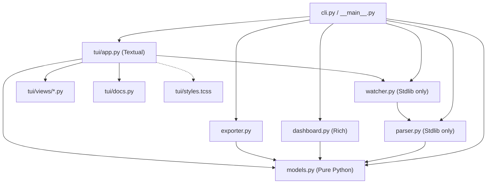
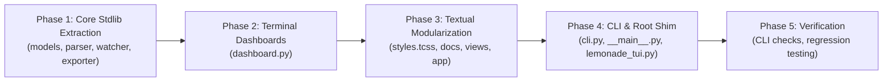

# Architectural Refactoring & Modularization Plan: `lemonade_tui`

> **Document Status:** Architectural Proposal & Implementation Blueprint  
> **Target File:** [`lemonade_tui.py`](file:///C:/Dev/github/philippeback/pgvector/lemonade_tui.py) (1,672 LOC)  
> **Target Package:** `lemonade_tui/`  
> **Compatibility:** 100% Backwards-Compatible (Preserves all CLI flags, commands, and public imports)

---

## 1. Executive Summary

[`lemonade_tui.py`](file:///C:/Dev/github/philippeback/pgvector/lemonade_tui.py) is a high-performance terminal inspection and analytics tool for Lemonade Server (and underlying `llama.cpp` inference engines). It provides deep visibility into prefill scaling, generation throughput, Speculative Decoding / Multi-Token Prediction (MTP), context retention, and static graph execution.

Currently, the entire application exists as a **single 1,672-line monolithic script**. While functional and feature-complete, combining domain models, log parsing, Rich rendering, Textual UI components, report generation, and CLI parsing into one file creates maintenance friction, hinders automated testing, and forces unnecessary dependencies on headless environments.

This document outlines a phased, zero-breaking-change plan to decompose `lemonade_tui.py` into a clean, modular Python package.

---

## 2. Current State Analysis

The current monolithic script spans seven distinct functional layers:

| Layer | Lines | Core Symbols | Responsibilities |
|---|---|---|---|
| **1. Domain Models** | 54–194 | [`PromptStep`](file:///C:/Dev/github/philippeback/pgvector/lemonade_tui.py#L54), [`GenStep`](file:///C:/Dev/github/philippeback/pgvector/lemonade_tui.py#L64), [`TaskMetrics`](file:///C:/Dev/github/philippeback/pgvector/lemonade_tui.py#L72) | Pure dataclasses and 9 computed telemetry properties (`queue_delay_s`, `effective_eval_tps`, etc.). |
| **2. Log Parser** | 195–464 | [`LemonadeLogParser`](file:///C:/Dev/github/philippeback/pgvector/lemonade_tui.py#L195), [`parse_lemonade_log`](file:///C:/Dev/github/philippeback/pgvector/lemonade_tui.py#L432) | Regex state machine parsing server heartbeats, slots, MTP, and token timings. |
| **3. Rich Dashboards** | 465–731 | [`build_rich_dashboard_renderable`](file:///C:/Dev/github/philippeback/pgvector/lemonade_tui.py#L465), [`watch_rich_dashboard`](file:///C:/Dev/github/philippeback/pgvector/lemonade_tui.py#L644) | Static and live-refreshing Rich terminal dashboards and capability matrix. |
| **4. Static Assets** | 736–877 | `DOC_TEXT`, `CSS` string | 30 lines of markdown documentation and 108 lines of Textual CSS embedded as strings. |
| **5. Textual TUI App** | 878–1519 | [`LemonadeTUIApp`](file:///C:/Dev/github/philippeback/pgvector/lemonade_tui.py#L767) | Interactive terminal UI with 6 tabs, event handlers, and data table reactivity. |
| **6. Exporter** | 1520–1594 | [`export_markdown_report`](file:///C:/Dev/github/philippeback/pgvector/lemonade_tui.py#L1524) | Standalone Markdown telemetry report generator. |
| **7. CLI & Path Resolver** | 1595–1672 | [`resolve_log_path`](file:///C:/Dev/github/philippeback/pgvector/lemonade_tui.py#L1599), [`main`](file:///C:/Dev/github/philippeback/pgvector/lemonade_tui.py#L1625) | Argument parsing, cross-platform path resolution (PowerShell `$env:TEMP` syntax), dispatch. |

---

## 3. Key Motivations for Modularization

### 3.1 Heavy Import Overhead & Coupling
* Importing `lemonade_tui` (e.g. `from lemonade_tui import parse_lemonade_log`) unconditionally imports both `textual` and `rich`.
* In CI/CD pipelines, headless telemetry scrapers, or lightweight log analyzers, importing Textual introduces unnecessary startup latency and memory overhead.

### 3.2 Duplicated Log Tailing Logic
* File tracking, seek position caching (`file_pos`), truncation/rotation checks, and delta line feeding are duplicated across:
  1. [`watch_rich_dashboard`](file:///C:/Dev/github/philippeback/pgvector/lemonade_tui.py#L656-L674) (Rich live dashboard)
  2. [`poll_log_updates`](file:///C:/Dev/github/philippeback/pgvector/lemonade_tui.py#L1101-L1134) (Textual TUI live loop)
* Bug fixes or improvements in log tailing currently must be applied in two separate places.

### 3.3 Testability & Separation of Concerns
* Unit testing the regex parser currently requires importing UI frameworks.
* Isolating `parser.py` and `models.py` allows pure standard-library unit tests (`pytest tests/test_parser.py`) that run in milliseconds.

### 3.4 Monolithic UI Component Rendering
* In [`LemonadeTUIApp`](file:///C:/Dev/github/philippeback/pgvector/lemonade_tui.py#L767), rendering logic for all 6 tabs is bundled into single monolithic methods ([`render_overview_pane`](file:///C:/Dev/github/philippeback/pgvector/lemonade_tui.py#L1373), [`render_speed_tables`](file:///C:/Dev/github/philippeback/pgvector/lemonade_tui.py#L1427), etc.).
* Externalizing styles to a `.tcss` file and splitting tabs into dedicated Textual `Widget` classes allows independent styling, testing, and modification.

---

## 4. Target Architecture & Package Layout

```text
lemonade_tui/
├── __init__.py               # Clean public API exports (TaskMetrics, LemonadeLogParser, parse_lemonade_log)
├── __main__.py               # Entrypoint for `python -m lemonade_tui`
├── cli.py                    # Argument parsing, path resolution, mode dispatch
├── models.py                 # Domain models: PromptStep, GenStep, TaskMetrics (Zero dependencies)
├── parser.py                 # LemonadeLogParser, parse_lemonade_log (Stdlib only)
├── watcher.py                # Reusable LogWatcher / file-tailing engine
├── exporter.py               # Markdown report generation
├── dashboard.py              # Rich terminal renderer (static snapshot, capability matrix, live watch)
└── tui/                      # Interactive Textual Application
    ├── __init__.py           # Exports LemonadeTUIApp
    ├── app.py                # App lifecycle, keybindings, state management, compose()
    ├── styles.tcss           # Externalized Textual CSS stylesheet
    ├── docs.py               # Documentation and capability matrix constants
    └── views/                # Modular Tab Views / Widgets
        ├── __init__.py
        ├── overview.py       # Overview data table and Gantt lifecycle bar
        ├── speed.py          # Prefill chunking & decode streaming tables
        ├── tokens.py         # Token allocation bars & MTP speculation meters
        └── context.py        # KV cache retention, slot allocation, and graph hits
```

### Backwards-Compatibility Shim
The original root file [`lemonade_tui.py`](file:///C:/Dev/github/philippeback/pgvector/lemonade_tui.py) will remain as a lightweight proxy:
```python
#!/usr/bin/env python3
"""Backwards-compatible entrypoint shim for lemonade_tui."""
from lemonade_tui.cli import main
from lemonade_tui.models import TaskMetrics, PromptStep, GenStep
from lemonade_tui.parser import LemonadeLogParser, parse_lemonade_log, parse_lemonade_log_with_parser

if __name__ == "__main__":
    main()
```
This ensures zero breakage for existing scripts, documentation commands (`python lemonade_tui.py`), or [`pyproject.toml`](file:///C:/Dev/github/philippeback/pgvector/pyproject.toml) entry references.

---

## 5. Dependency Flow Diagram



> [!NOTE]
> Notice the clean layered hierarchy: `models.py`, `parser.py`, and `watcher.py` form a zero-UI core layer that depends only on the Python standard library. `dashboard.py` depends on `rich`. `tui/` depends on `textual`.

---

## 6. Detailed Module Specifications

### 6.1 `lemonade_tui/models.py`
* **Dependencies:** `dataclasses`, `typing`, `Optional`, `List`, `Dict` (Zero third-party dependencies).
* **Contents:**
  * [`PromptStep`](file:///C:/Dev/github/philippeback/pgvector/lemonade_tui.py#L54): Prefill chunk metrics (`n_tokens`, `progress`, `elapsed_s`, `speed_tps`).
  * [`GenStep`](file:///C:/Dev/github/philippeback/pgvector/lemonade_tui.py#L64): Generation interval metrics (`n_gen`, `tg_tps`, `tg_3s_tps`).
  * [`TaskMetrics`](file:///C:/Dev/github/philippeback/pgvector/lemonade_tui.py#L72): Aggregated task telemetry.
  * Computed properties:
    * `queue_delay_s`: Request arrival to slot launch latency.
    * `end_to_end_tps`: Comprehensive total-time throughput.
    * `draft_rejected`: Speculative MTP tokens discarded.
    * `prompt_ratio` / `gen_ratio`: In/out token split percentages.
    * `effective_*`: Fallback derivations when summary log lines are missing.

### 6.2 `lemonade_tui/parser.py`
* **Dependencies:** `re`, `datetime`, `os`, `typing`, `lemonade_tui.models` (Stdlib only).
* **Contents:**
  * Regular expressions compiled at module level for optimal performance.
  * [`LemonadeLogParser`](file:///C:/Dev/github/philippeback/pgvector/lemonade_tui.py#L195):
    * State machine tracking `current_task`, `tasks`, and `request_timestamps`.
    * `feed_line(line: str) -> bool`: Incremental line parser returning `True` if task state updated.
    * `get_tasks() -> List[TaskMetrics]`: Returns parsed and filtered tasks.
  * Helper functions:
    * [`parse_lemonade_log`](file:///C:/Dev/github/philippeback/pgvector/lemonade_tui.py#L432)
    * [`parse_lemonade_log_with_parser`](file:///C:/Dev/github/philippeback/pgvector/lemonade_tui.py#L448)

### 6.3 `lemonade_tui/watcher.py`
* **Dependencies:** `os`, `time`, `typing`, `lemonade_tui.parser` (Stdlib only).
* **Contents:**
  * `LogWatcher`:
    ```python
    class LogWatcher:
        def __init__(self, file_path: str, parser: Optional[LemonadeLogParser] = None):
            self.file_path = file_path
            self.parser = parser or LemonadeLogParser()
            self.file_pos = 0

        def poll(self) -> Tuple[bool, List[TaskMetrics]]:
            """Check for new log lines, handle log rotation/truncation, and update parser."""
            ...
    ```
* **Value:** Encapsulates file-seeking, truncation detection, and parsing into a single tested component.

### 6.4 `lemonade_tui/dashboard.py`
* **Dependencies:** `rich`, `lemonade_tui.models`, `lemonade_tui.watcher`.
* **Contents:**
  * [`build_rich_dashboard_renderable`](file:///C:/Dev/github/philippeback/pgvector/lemonade_tui.py#L465)
  * [`render_rich_dashboard`](file:///C:/Dev/github/philippeback/pgvector/lemonade_tui.py#L636)
  * [`watch_rich_dashboard`](file:///C:/Dev/github/philippeback/pgvector/lemonade_tui.py#L644) (re-implemented cleanly using `LogWatcher`)
  * [`print_capability_matrix`](file:///C:/Dev/github/philippeback/pgvector/lemonade_tui.py#L679)

### 6.5 `lemonade_tui/exporter.py`
* **Dependencies:** `lemonade_tui.models`.
* **Contents:**
  * [`export_markdown_report`](file:///C:/Dev/github/philippeback/pgvector/lemonade_tui.py#L1524): High-depth Markdown analytics report generation.
  * Extension hook for future formats (e.g. `export_json_report`, `export_csv_report`).

### 6.6 `lemonade_tui/tui/`
* **Dependencies:** `textual`, `rich`, `lemonade_tui.models`, `lemonade_tui.watcher`.
* **Sub-components:**
  * `styles.tcss`: Extracted from inline CSS string (lines 770–877) into a standalone stylesheet.
  * `docs.py`: Contains `DOC_TEXT` guide and capability tables.
  * `app.py`: Contains [`LemonadeTUIApp`](file:///C:/Dev/github/philippeback/pgvector/lemonade_tui.py#L767):
    * Keybindings, app lifecycle, debounce timers, dynamic tailing timer.
  * `views/`: Dedicated pane renderers:
    * `OverviewPane`: Multi-task data table, Gantt bar, status ribbon.
    * `SpeedPane`: Prompt prefill chunk table and token generation rate meters.
    * `TokensPane`: Input/Output token balance and Speculative MTP acceptance meters.
    * `ContextPane`: KV cache footprint, slot ID, and execution graph reuse hits.

### 6.7 `lemonade_tui/cli.py`
* **Dependencies:** `argparse`, `sys`, `os`, `lemonade_tui.*`.
* **Contents:**
  * [`resolve_log_path`](file:///C:/Dev/github/philippeback/pgvector/lemonade_tui.py#L1599)
  * [`main`](file:///C:/Dev/github/philippeback/pgvector/lemonade_tui.py#L1625): CLI argument parsing and execution dispatch.

---

## 7. Step-by-Step Implementation Roadmap



### Phase 1: Core Non-UI Extraction
1. Create `lemonade_tui/` directory.
2. Extract [`PromptStep`](file:///C:/Dev/github/philippeback/pgvector/lemonade_tui.py#L54), [`GenStep`](file:///C:/Dev/github/philippeback/pgvector/lemonade_tui.py#L64), and [`TaskMetrics`](file:///C:/Dev/github/philippeback/pgvector/lemonade_tui.py#L72) into `lemonade_tui/models.py`.
3. Extract [`LemonadeLogParser`](file:///C:/Dev/github/philippeback/pgvector/lemonade_tui.py#L195) and parsing helpers into `lemonade_tui/parser.py`.
4. Create `lemonade_tui/watcher.py` with the shared `LogWatcher`.
5. Extract [`export_markdown_report`](file:///C:/Dev/github/philippeback/pgvector/lemonade_tui.py#L1524) into `lemonade_tui/exporter.py`.

### Phase 2: Rich Visualizer Extraction
1. Create `lemonade_tui/dashboard.py`.
2. Move [`build_rich_dashboard_renderable`](file:///C:/Dev/github/philippeback/pgvector/lemonade_tui.py#L465), [`render_rich_dashboard`](file:///C:/Dev/github/philippeback/pgvector/lemonade_tui.py#L636), and [`print_capability_matrix`](file:///C:/Dev/github/philippeback/pgvector/lemonade_tui.py#L679).
3. Refactor [`watch_rich_dashboard`](file:///C:/Dev/github/philippeback/pgvector/lemonade_tui.py#L644) to utilize `LogWatcher`.

### Phase 3: Textual Modularization
1. Create `lemonade_tui/tui/styles.tcss` from the 108-line CSS string.
2. Create `lemonade_tui/tui/docs.py` containing `DOC_TEXT`.
3. Create `lemonade_tui/tui/views/` and split tab-rendering logic into distinct view widgets.
4. Clean up `lemonade_tui/tui/app.py` to focus exclusively on application state and event dispatching.

### Phase 4: CLI Entrypoints & Root Shim
1. Create `lemonade_tui/cli.py` with [`resolve_log_path`](file:///C:/Dev/github/philippeback/pgvector/lemonade_tui.py#L1599) and [`main`](file:///C:/Dev/github/philippeback/pgvector/lemonade_tui.py#L1625).
2. Create `lemonade_tui/__main__.py` invoking `lemonade_tui.cli.main()`.
3. Convert root [`lemonade_tui.py`](file:///C:/Dev/github/philippeback/pgvector/lemonade_tui.py) to re-export the public API and invoke `main()`.

### Phase 5: Verification & Parity Testing
Execute the complete CLI verification suite:
* `python lemonade_tui.py --static`
* `python lemonade_tui.py --static --all`
* `python lemonade_tui.py --export test_report.md`
* `python -m lemonade_tui --static`
* Interactive TUI test (`python lemonade_tui.py`)
* Public import check (`python -c "from lemonade_tui import parse_lemonade_log; print(parse_lemonade_log('lemonade-sample.log'))"`)

---

## 8. Risk Management & Backwards Compatibility

| Potential Risk | Impact | Mitigation Strategy |
|---|---|---|
| **Broken CLI Commands** | High | Root `lemonade_tui.py` is maintained as an executable shim that delegates directly to `lemonade_tui.cli:main`. |
| **Broken `pyproject.toml` Builds** | Medium | Update [`pyproject.toml`](file:///C:/Dev/github/philippeback/pgvector/pyproject.toml#L18) packages configuration to recognize `lemonade_tui` as a package while keeping the top-level module shim. |
| **Behavioral Regression in TUI** | Medium | Retain existing method signatures, reactive attributes, and keybindings in `LemonadeTUIApp`. |
| **Missing CSS in Distribution** | Low | Bundle `styles.tcss` in `package_data` or use `pkgutil.get_data` / `importlib.resources`. |

---

## 9. Conclusion

Decomposing `lemonade_tui.py` transforms a 1,672-line monolithic script into an extensible, professional telemetry suite. It enables headless execution without GUI overhead, eliminates duplicated file tailing logic, isolates clean domain models, and ensures 100% backwards compatibility with all existing workflows.
